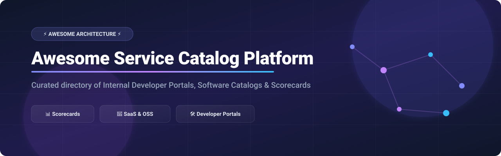

# 🚀 Awesome Service Catalog Platforms

  

  
  
  
  
  

> **A curated directory of top Service Catalog Platforms, Internal Developer Portals (IDP), Software Ownership Catalogs, Scorecards, and Platform Engineering Tools.**

---

## 📌 Overview & SEO Keywords

This repository tracks leading commercial **SaaS platforms** and top **open-source projects** for **Service Catalogs** and **Internal Developer Portals (IDP)**. These systems provide centralized service discovery, ownership tracking, microservice metadata management, production readiness scorecards, and self-service capabilities so engineering and DevOps teams can manage microservices at scale.

**Key Topics**: `service-catalog`, `internal-developer-portal`, `platform-engineering`, `software-catalog`, `backstage`, `service-ownership`, `scorecards`, `microservice-management`, `finops`, `idp`.

---

## 📑 Table of Contents

- [💼 SaaS & Hosted Platforms](#-saas--hosted-platforms)
- [🔓 Open-Source GitHub Projects](#-open-source-github-projects)
- [💡 Additional Open-Source Options & Tools](#-additional-open-source-options--tools)
- [🤝 How to Contribute](#-how-to-contribute)
- [⚖️ Disclaimer](#%EF%B8%8F-disclaimer)
- [📈 Star History](#-star-history)

---

## 💼 SaaS & Hosted Platforms

> **Market Insights**: The global Internal Developer Portal & Service Catalog sector is estimated at **~$1.5 Billion** (growing at >25% CAGR toward ~$4.5B by 2030). The market is **moderately fragmented**, featuring massive enterprise ecosystem platforms (ServiceNow, Atlassian) alongside specialized developer portal category leaders (Port, Cortex) and open-source foundation platforms (Backstage).

The table below is sorted by **Company Size (Valuation / Revenue)** in **descending order**:

| Platform / Product 🌐 | Description 📝 | Company Size (Valuation / Revenue) 💰 | Starting Tier Pricing 💳 | Free Tier / Free Trial Limits 🎁 |
| :--- | :--- | :--- | :--- | :--- |
| **[ServiceNow Service Catalog](https://www.servicenow.com/)** | Enterprise IT service catalog and request portal embedded within ServiceNow ITSM. | **~$170 Billion** (Public: NOW, ~$10.9B Rev) | ~$70 / fulfiller user / month (ITSM starting tier) | Free Personal Developer Instance (PDI) sandbox |
| **[Atlassian Compass](https://www.atlassian.com/software/compass)** | Component catalog and developer portal tightly integrated with Jira, Bitbucket, and Atlassian tools. | **~$45 Billion** (Public: TEAM, ~$4.4B Rev) | $7.00 / full user / month (Standard plan) | Free forever for up to 3 full users (unlimited basic users) |
| **[PagerDuty (Rundeck)](https://www.rundeck.com/)** | Self-service runbook automation platform serving as an action execution backend for developer portals. | **~$1.8 Billion** (Public: PD, ~$440M Rev) | $59 / user / month (PagerDuty Runbook Automation SaaS) | Free forever for Community Edition (self-hosted) / 14-day trial (SaaS) |
| **[Port](https://www.getport.io/)** | Flexible internal developer portal & service catalog focused on data modeling, self-service actions, and scorecards. | **$800 Million** (Series C, $160M raised) | $30 / seat / month (Basic plan) | Free forever for up to 15 seats |
| **[Cortex](https://www.cortex.io/)** | Engineering intelligence and developer portal for scorecards, production readiness, and cataloging. | **$470 Million** (Series C, $112M raised) | ~$35 / developer / month (Starting tier) | 14-day guided free trial / Proof-of-Concept |
| **[Morpheus Data](https://morpheusdata.com/)** | Multi-cloud management and self-service orchestration portal for hybrid IT and platform engineering. | **~$150 Million** (Acquired by HPE, HPE Cap ~$25B) | ~$2,083 / month ($25,000/yr entry tier) | Free Community Edition (home lab) / 60-day trial (VM Essentials) |
| **[Humanitec](https://humanitec.com/)** | Internal developer platform and cloud-native application orchestrator with service catalog capabilities. | **~$120 Million** ($34M total funding raised) | $1,979 / month (Teams plan, 5 users) | 30-day free trial |
| **[StackState](https://www.stackstate.com/)** | Observability and topology-based catalog (SUSE Cloud Observability) mapping service dependencies. | **~$100 Million** (Acquired by SUSE) | $99 / month ($9.99/host/mo, min 10 hosts) | 30-day free trial (Free for SUSE Rancher Prime users) |
| **[FireHydrant](https://www.firehydrant.com/)** | Incident management platform with service catalog mapping services, ownership, and response. | **~$100 Million** ($32.5M total funding raised) | $25 / responder / month (Pro plan, annual) | Free forever for up to 10 responders (or 14-day Pro trial) |
| **[CloudBolt](https://www.cloudbolt.io/)** | Hybrid cloud management platform and self-service portal for provisioning infrastructure and services. | **~$85 Million** ($38M total funding raised) | ~$708 / month ($8,500/yr entry subscription) | Free forever for up to 100 managed resources |
| **[OpsLevel](https://www.opslevel.com/)** | Service catalog and developer portal emphasizing service maturity scorecards and operational standards. | **~$80 Million** ($22.2M total funding raised) | ~$39 / developer / month (Standard plan) | 14-day to 30-day free trial / Proof-of-Concept |
| **[Mia-Platform](https://mia-platform.eu/)** | Enterprise internal developer platform and software catalog for orchestrating microservices and APIs. | **~$50 Million** (~$18M ARR) | ~$5,000 / month ($60,000/yr base tier) | 30-day guided free trial / Proof-of-Concept |
| **[Roadie](https://roadie.io/)** | Managed SaaS Backstage offering providing a hosted software catalog without operational overhead. | **~$40 Million** ($5.6M total funding raised) | $24 / developer / month (Teams plan) | 30-day free trial (SaaS) / Free forever for <15 users (Roadie Local) |
| **[CloudTruth](https://www.cloudtruth.com/)** | Centralized configuration management platform providing parameter and secret context to catalogs. | **~$25 Million** ($5.5M total funding raised) | $499 / month (Pro plan) | 14-day free trial (Free forever for open-source & non-profits) |
| **[Appvia (Wayfinder)](https://www.appvia.io/)** | Kubernetes developer portal and platform management tool for self-service infrastructure. | **~$20 Million** ($4M total funding raised) | $799 / month (Pro plan up to 3 products) | Free forever for 1 product (unlimited users) |

---

## 🔓 Open-Source GitHub Projects

The table below features popular open-source frameworks, software catalogs, and platform engineering tools. Sorted by **GitHub Star Count** in **descending order**. Click any star badge to visit that repository's stargazers page:

| Repository 📦 | Star_Count 🌟 | Description 📝 |
| :--- | :--- | :--- |
| **[Backstage](https://github.com/backstage/backstage)** |  | Spotify's CNCF open-source framework for building internal developer portals, service catalogs, TechDocs, and software templates. |
| **[Crossplane](https://github.com/crossplane/crossplane)** |  | CNCF framework to build control planes and orchestrate cloud infrastructure abstractions for developer self-service. |
| **[Score](https://github.com/score-spec/spec)** |  | Open developer-centric workload specification that translates application definitions into platform-specific infrastructure. |
| **[KubeVela](https://github.com/kubevela/kubevela)** |  | CNCF modern application delivery platform enabling platform teams to build developer-facing portals and self-service capabilities. |
| **[OpenCost](https://github.com/opencost/opencost)** |  | CNCF real-time Kubernetes cost monitoring and allocation engine powering FinOps scorecards in developer portals. |
| **[Devtron](https://github.com/devtron-labs/devtron)** |  | Open-source Kubernetes dashboard and developer portal providing software cataloging, CI/CD, and access control. |
| **[Cyclops](https://github.com/cyclops-ui/cyclops)** |  | Developer-friendly Kubernetes management portal providing customizable UI templates and service deployment catalogs. |
| **[Radius](https://github.com/radius-project/radius)** |  | Microsoft-backed open-source cloud-native application platform linking microservice dependencies and platform infrastructure. |
| **[Kratix](https://github.com/syntasso/kratix)** |  | Open-source platform-engineering framework for building custom internal developer platforms and self-service infrastructure. |
| **[Walrus](https://github.com/seal-io/walrus)** |  | Application management platform empowering platform teams to build reusable infrastructure templates for developers. |

---

## 💡 Additional Open-Source Options & Tools

- 🛠️ **Backstage Software Catalog**: Core Backstage plugin ingesting YAML entity descriptors to catalog services, APIs, resources, and systems.
- 📑 **Software Templates (Backstage Scaffolder)**: Scaffolding engine for instant service creation with automated CI/CD and repository setup.
- 📚 **TechDocs / Docs-as-Code**: Markdown-based documentation framework integrated into developer portals.
- 📈 **Scorecard & Maturity Plugins**: Community plugins measuring production readiness, security compliance, and DORA metrics.
- ⚙️ **Entity Ingestion Connectors**: Open plugins pulling metadata from GitHub, GitLab, Kubernetes clusters, AWS, and PagerDuty.

---

## 🤝 How to Contribute

Contributions are highly welcome! Please follow these simple steps:

1. 🍴 Fork the repository.
2. 📝 Add or edit entries in `README.md` using clean Markdown formatting.
3. 🔗 Include company/project name, official website link, accurate pricing, free tier limits, and concise factual description.
4. 🚀 Submit a Pull Request (PR) with a brief summary of changes.

---

## ⚖️ Disclaimer

- This list is **community-curated** for educational and evaluation purposes.
- Valuations and pricing details reflect public announcements and market research estimates as of 2026.
- Self-hosting Backstage or open-source portals requires dedicated platform engineering capacity. Evaluate total cost of ownership (TCO) when choosing between self-hosted open-source and managed SaaS solutions.

---

## 📈 Star History

---

**Made with ❤️ for Platform Engineers, SREs, and DevOps Teams.**
